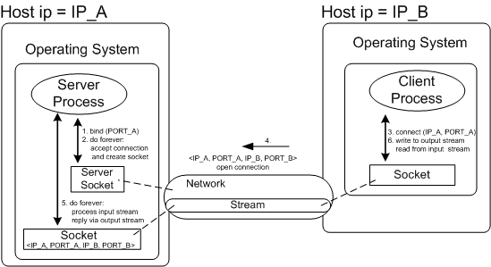

##What is Socket?
- Socket最早緣起於Unix，而在Unix的檔案可以用`開啟open -> 讀寫write/read -> 關閉close`的模式來操作所以Socket在Unix當中也遵循這樣的操作模式，算是一種文件，Socket所提供的API就是可以進行的操作（開啟/關閉、讀寫）。
- TCP/IP協定的程式都是採用Socket來進行連接傳輸的介面，最常見的例子就是網頁瀏覽器，底層都是用Socket去做實作通信的介面。
- Socket是一個網路上的通訊端點，使用者或應用程式只要連結到 Socket 便可以和網路上任何一個通訊端點連線，Socket 之間的通訊就如同作業系統內程序 (process) 之間通訊一樣。
- Socket架構圖解

*來源:http://www.cs.bgu.ac.il/~spl121/wiki.files/tcp[1].gif
